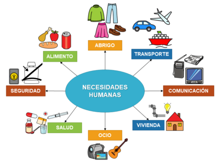
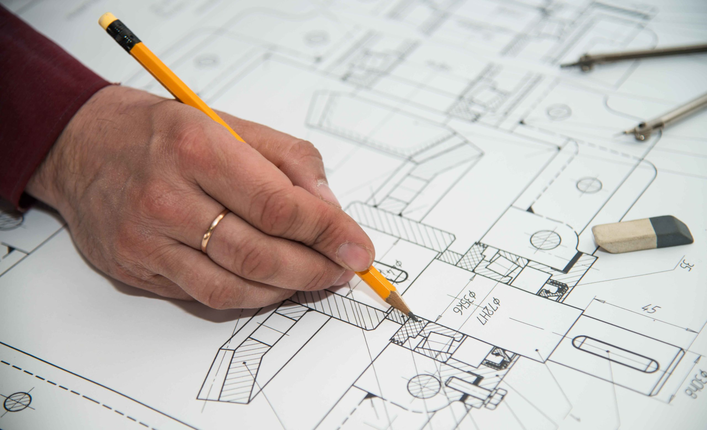
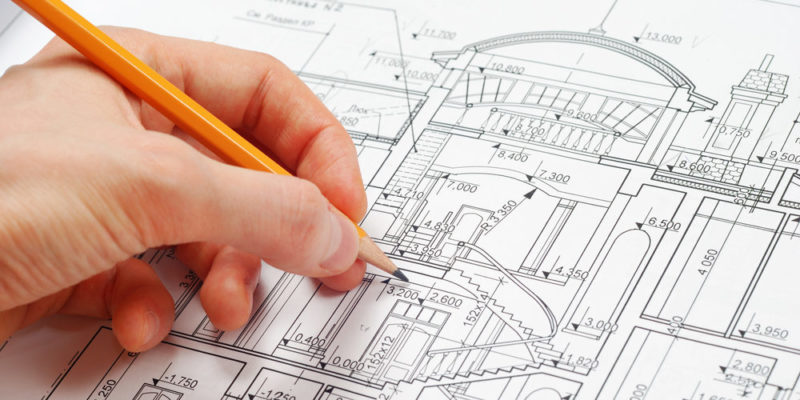

# Capítulo 1: **¿Para qué dibujamos en Tecnología?**

https://ibiguridt.wordpress.com/

## **1.1. La Tecnología y la resolución de problemas**

{align=right width=50%}

Desde la antigüedad, los seres humanos hemos tenido **necesidades**: alimentarnos, vestirnos, tener una vivienda, comunicarnos o viajar. Para cubrirlas, no actuamos de forma improvisada, sino que aplicamos nuestros conocimientos y técnicas de manera ordenada para modificar nuestro entorno y crear soluciones., por ejemplo, **construyendo objetos** o **diseñando servicios**.

* ¿Qué objetos fabrica el ser humano para satisfacer la necesidad secundaria de viajar?

* ¿Qué objetos fabrica el ser humano para satisfacer la necesidad primaria de la salud?

A este conjunto de conocimientos y técnicas lo llamamos **Tecnología**, y al método ordenado que seguimos para crear esas soluciones lo llamamos **proceso tecnológico**. Este proceso, de forma simplificada, sigue siempre unos pasos parecidos:

1.  **Identificar el problema** o la necesidad que queremos resolver.
2.  **Buscar información** para ver cómo se ha resuelto antes.
3.  **Diseñar varias ideas** y elegir la mejor.
4.  **Planificar y construir** la solución.
5.  **Evaluar** si hemos resuelto el problema.

## **1.2. El dibujo como lenguaje universal**

Ahora piensa, ¿cómo podríamos comunicar nuestras ideas en la fase de diseño? "**Explicar con palabras** cómo es el plano de una casa o cómo se monta un juguete es **muy difícil**".

Por eso, en tecnología usamos la **expresión gráfica**, un lenguaje visual que utiliza imágenes en lugar de palabras para comunicar ideas. La gran ventaja de una imagen es que es universal: todo el mundo puede entenderla, sin importar su idioma o cultura.

!!! note "Expresión gráfica"

    La **expresión gráfica** es una forma de comunicación, un lenguaje visual que **utiliza imágenes en lugar de palabras** para comunicar ideas, conceptos o sentimientos. Se considera un lenguaje universal, ya que puede ser entendido por cualquier persona sin importar su cultura, raza o religión. 
    
Su objetivo es expresar de manera sencilla cosas que serían muy difíciles de explicar solo con palabras, como el plano de un edificio o las instrucciones de montaje de un objeto. Este lenguaje se manifiesta a través del dibujo, la fotografía y el vídeo.

{align=right width=100%}

## **1.3. Dibujo artístico vs. Dibujo técnico**

No todos los dibujos son iguales. Podemos diferenciar dos grandes tipos:

*   **Dibujo artístico:** Expresa sentimientos e ideas de forma subjetiva, como un cuadro o un retrato.
*   **Dibujo técnico:** Representa objetos de forma precisa y objetiva, con el fin de poder construirlos después. Los planos de un edificio o las piezas de una máquina son dibujos técnicos.

{align=left width=40%} {align=right width=55%}  
  

En la materia de Tecnología, nos centraremos en el **dibujo técnico**, ya que nuestro objetivo es **comunicar ideas de forma clara** para que cualquiera pueda entenderlas y fabricarlas.

***

Ahora que sabemos por qué es importante dibujar, ¿qué tipo de dibujo crees que haríamos en la fase de "Generación y selección de ideas", cuando apenas estamos empezando a dar forma a nuestra solución? ¿Sería un dibujo muy detallado o algo más rápido y esquemático?