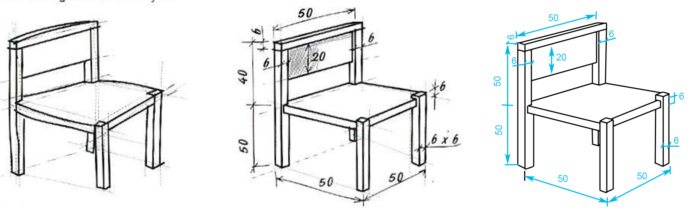
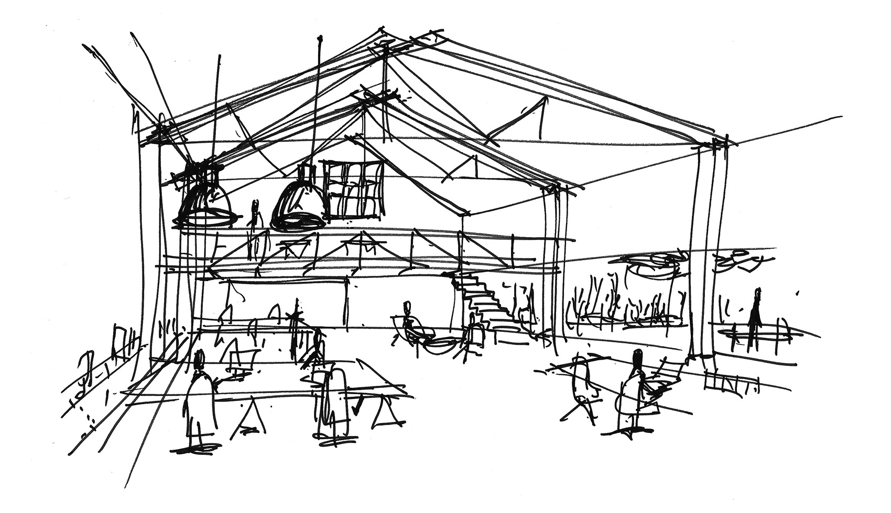
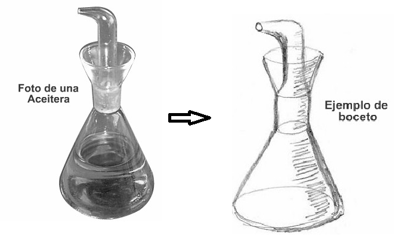
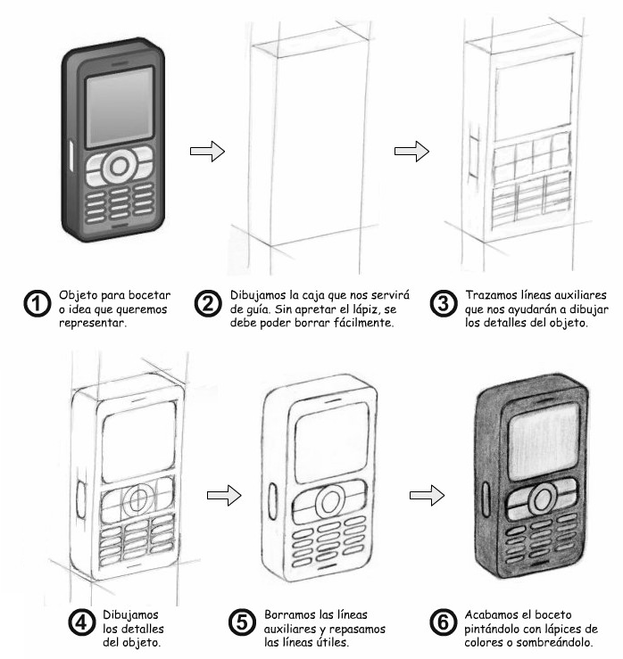
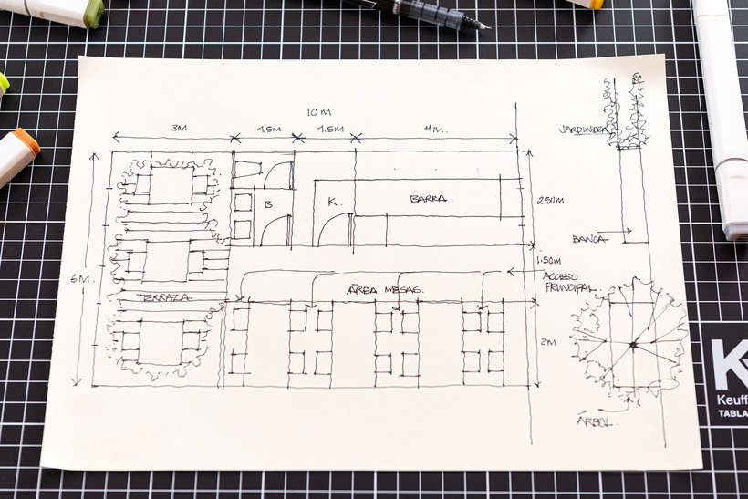

# Del boceto al croquis

En el capítulo anterior, te pregunté qué tipo de dibujo haríamos en la fase de "Generación y selección de ideas". Efectivamente, cuando estamos explorando soluciones, necesitamos algo rápido y esquemático.

Este capítulo verás la diferencia entre un **boceto** y un **croquis**.

***

Una vez que tenemos una idea, necesitamos plasmarla en papel para poder analizarla, mejorarla y compartirla. En esta fase creativa del proceso tecnológico, no empezamos con un plano perfecto, sino con **dibujos más sencillos y rápidos**.

``` mermaid
graph LR
  A[Boceto] ----> B[Croquis];
  B ----> C[Plano];
```
{align=right width=100%}

## El boceto: la primera idea

El primer dibujo que realizamos se llama **boceto**. Es la forma más rápida de representar nuestra idea inicial.

Sus características principales son:

{align=right width=50%}

*   Se dibuja **a mano alzada**, es decir, sin usar reglas ni otros instrumentos.
*   No tiene por qué ser perfecto, pero sí debe ser claro para que se entiendan los aspectos fundamentales del objeto, como su forma o tamaño.
*   No guarda las proporciones exactas y no lleva anotadas las medidas (no está "acotado").
   
### Técnicas para dibujar bocetos

Para hacer un buen boceto, sigue estos pasos:

1. **Dibuja líneas suaves:** Usa trazos ligeros para poder corregir fácilmente.
2. **Enfócate en la forma general:** No te preocupes por los detalles.
3. **Usa varias vistas:** Si es necesario, dibuja el objeto desde diferentes ángulos para entenderlo mejor.
4. **Añade notas rápidas:** Si quieres, puedes escribir palabras clave que ayuden a describir tu idea.
5. **Sé creativo:** No tengas miedo de experimentar con diferentes formas y conceptos.

Para dibujar bocetos existen procedimientos (trucos) para que nos sea más fácil:

* Técnica del **eje de simetría**: Dibuja una línea vertical en el centro del objeto. Esto te ayudará a mantener las proporciones y simetría.

  

* Técnica del **cajeado**: Dibuja un rectángulo o caja que contenga el objeto. Esto te ayudará a definir sus límites y proporciones.

  

## El croquis: el dibujo detallado

Cuando ya hemos elegido la idea que más nos gusta a partir de los bocetos, pasamos a un dibujo más elaborado: el **croquis**.

{align=right width=50%}

El croquis también se realiza a mano alzada, pero es mucho más preciso. De hecho, se considera la representación gráfica definitiva de la idea y debe contener toda la información necesaria para que alguien pueda fabricar el objeto. Esto incluye:

*   Formas y detalles bien definidos.
*   Dimensiones (medidas), materiales, colores, etc..

En resumen, pasamos de una idea general (boceto) a un diseño concreto y con medidas (croquis).