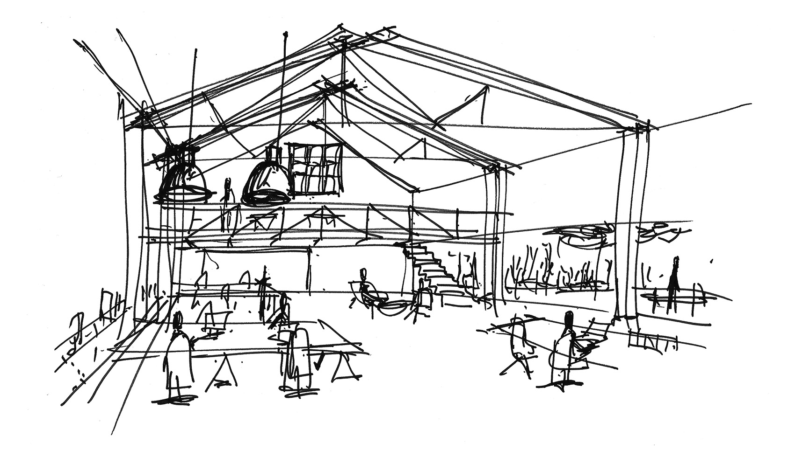

# Capítulo 2: **Del boceto al croquis**

En el capítulo anterior, te pregunté qué tipo de dibujo haríamos en la fase de "Generación y selección de ideas". Efectivamente, cuando estamos explorando soluciones, necesitamos algo rápido y esquemático.

Este capítulo verás la diferencia entre un **boceto** y un **croquis**.
***

Una vez que tenemos una idea, necesitamos plasmarla en papel para poder analizarla, mejorarla y compartirla. En esta fase creativa del proceso tecnológico, no empezamos con un plano perfecto, sino con **dibujos más sencillos y rápidos**.

{align=right width=100%}

## **2.1. El Boceto: La primera idea**

El primer dibujo que realizamos se llama **boceto**. Es la forma más rápida de representar nuestra idea inicial.

Sus características principales son:

{align=right width=50%}

*   Se dibuja **a mano alzada**, es decir, sin usar reglas ni otros instrumentos.
*   No tiene por qué ser perfecto, pero sí debe ser claro para que se entiendan los aspectos fundamentales del objeto, como su forma o tamaño.
*   No guarda las proporciones exactas y no lleva anotadas las medidas (no está "acotado").

## **2.2. El Croquis: El dibujo detallado**

Cuando ya hemos elegido la idea que más nos gusta a partir de los bocetos, pasamos a un dibujo más elaborado: el **croquis**.

{align=right width=50%}

El croquis también se realiza a mano alzada, pero es mucho más preciso. De hecho, se considera la representación gráfica definitiva de la idea y debe contener toda la información necesaria para que alguien pueda fabricar el objeto. Esto incluye:

*   Formas y detalles bien definidos.
*   Dimensiones (medidas), materiales, colores, etc..

En resumen, pasamos de una idea general (boceto) a un diseño concreto y con medidas (croquis).

***

Hemos visto que tanto el boceto como el croquis se hacen a mano alzada. Ahora, si quisiéramos crear un dibujo todavía más preciso y "limpio", ¿qué tipo de herramientas crees que necesitaríamos usar en lugar de solo nuestra mano y un lápiz?