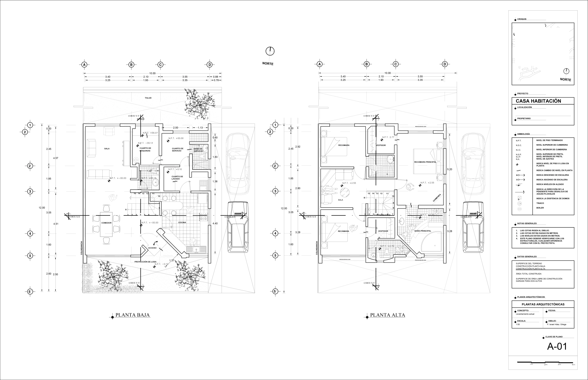
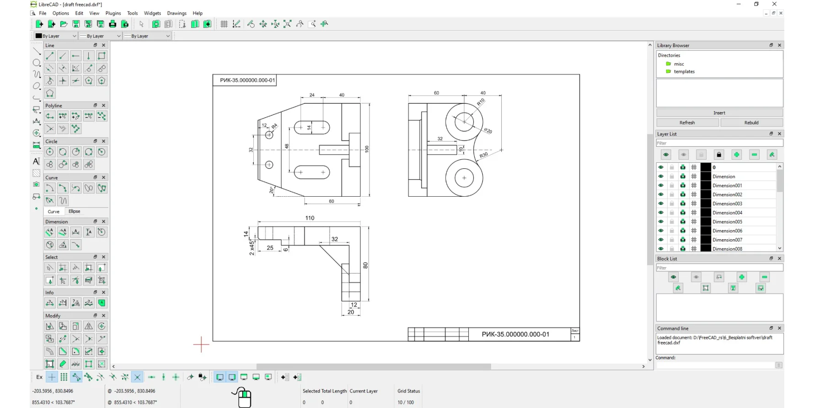

***

# Capítulo 3: **El Plano (o Dibujo Delineado)**

{align=right width=30%}

Como vimos en el capítulo anterior, **el boceto y el croquis** son dibujos que se realizan a mano alzada para plasmar nuestras primeras ideas. Sin embargo, cuando necesitamos que la representación de un objeto sea lo más exacta posible para poder fabricarlo, pasamos a un dibujo mucho más preciso: el **plano** o **dibujo delineado**.

!!! note "Plano"

    Un plano es un dibujo técnico que se realiza utilizando herramientas auxiliares de dibujo, como la regla, la escuadra, el cartabón y el compás. Este tipo de dibujo contiene toda la información necesaria y detallada para la construcción del objeto.

{align=right width=100%}

Hoy en día, además de los instrumentos tradicionales, es muy común utilizar ordenadores con programas específicos de **Diseño Asistido por Ordenador (CAD)**, como LibreCAD, que permiten realizar y modificar planos de forma mucho más fácil y precisa.

{align=right width=100%}

***

El siguiente paso lógico, según nuestra nueva estructura, es hablar de los materiales que necesitamos para pasar de un croquis a mano alzada a un plano bien delineado. ¿Recuerdas cuáles son algunas de esas herramientas básicas que mencionamos?