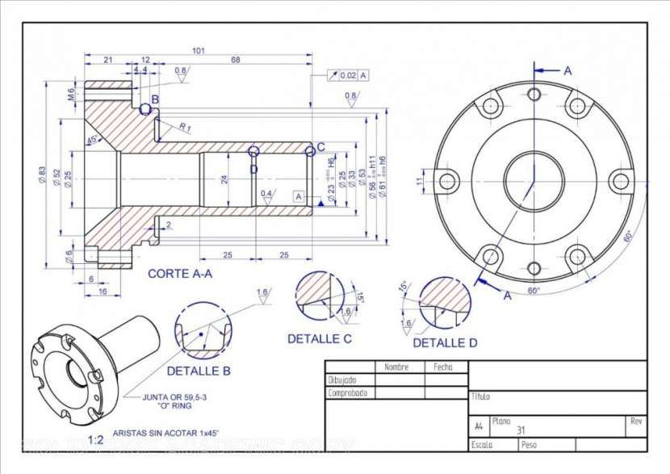
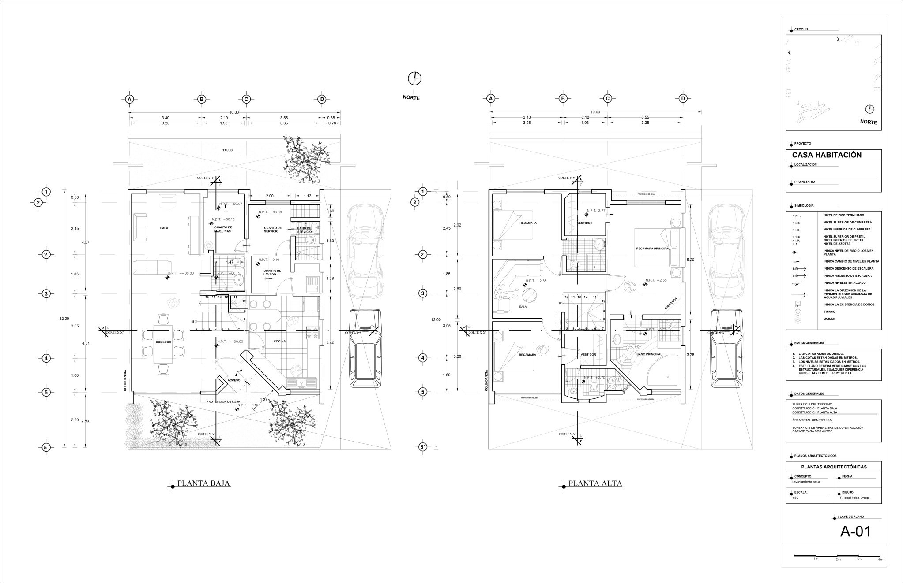
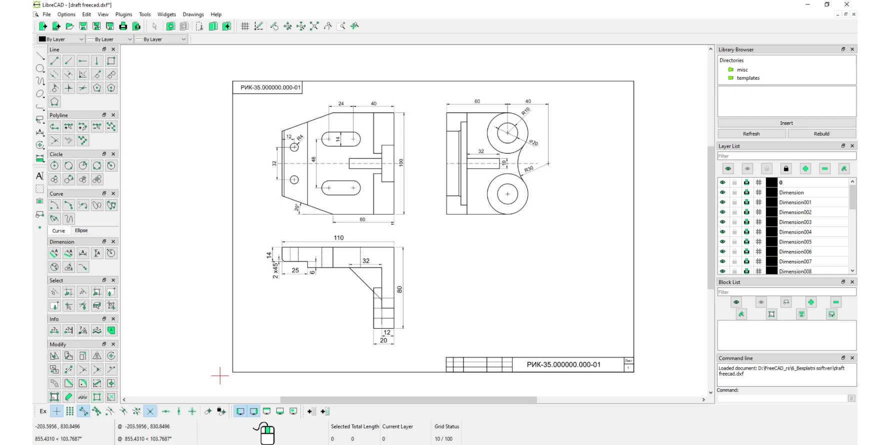

# El Plano (o dibujo delineado)  

{align=right width=30%}  

En el capítulo anterior aprendimos que el **boceto** y el **croquis** son dibujos hechos a **mano alzada**, que nos sirven para expresar nuestras primeras ideas.  
Pero cuando ya tenemos clara la forma definitiva del objeto y necesitamos representarlo con precisión para **fabricarlo**, damos un paso más y realizamos un **plano** o **dibujo delineado**, que es el más exacto de todos.

## ¿Qué es un plano?

!!! note "Plano"
    Un **plano** es un tipo de **dibujo técnico** que se realiza con **instrumentos de dibujo** (como la regla, la escuadra, el cartabón o el compás) o con ayuda del ordenador. 
     
    Este dibujo contiene **toda la información necesaria** para construir un objeto: sus formas, medidas, materiales y detalles.

{align=right width=100%}

Los planos permiten que **cualquier persona** (por ejemplo, un carpintero, un técnico o un ingeniero) pueda entender cómo construir exactamente el objeto sin necesidad de explicaciones largas.  
Por eso, el plano es el **lenguaje universal** de la tecnología, ya que todos los profesionales lo comprenden igual.

## Tipos de planos  
Dependiendo de lo que queramos dibujar, existen diferentes tipos de planos:  

- **Plano de conjunto:** muestra cómo están colocadas las distintas piezas que forman un objeto.  
- **Plano de pieza:** representa una sola parte con todas sus medidas.  
- **Plano arquitectónico:** se usa para representar edificios, casas o espacios.  

Cada tipo de plano tiene una **escala**, que es una forma de representar objetos grandes o pequeños en un tamaño adecuado para el papel.

## El dibujo con instrumentos y el uso de programas CAD  

Tradicionalmente, los planos se dibujaban **a mano**, utilizando herramientas como el **compás**, las **escuadras**, la **regla** o el **cartabón**.  
Hoy en día, además de estos instrumentos, se emplean programas de ordenador llamados **CAD (Diseño Asistido por Ordenador)**, como **LibreCAD** o **AutoCAD**, que permiten dibujar planos de forma más **rápida, precisa** y fácil de modificar.

{align=right width=100%}

Los programas CAD son herramientas muy importantes en la tecnología moderna, ya que se utilizan en casi todos los sectores: diseño industrial, arquitectura, ingeniería, robótica, muebles, moda y muchos más.

## Para pensar...  

El siguiente paso lógico en el proceso de diseño es **preparar los materiales y herramientas** que nos ayudarán a pasar del **croquis** (hecho a mano alzada) al **plano** (con instrumentos o con ordenador).  

¿Recuerdas cuáles son algunas de esas herramientas básicas?  
Piensa en objetos como la **regla**, la **escuadra**, el **cartabón**, el **compás** o el **rotulador técnico**, que son esenciales para empezar a delinear como un verdadero diseñador.

---