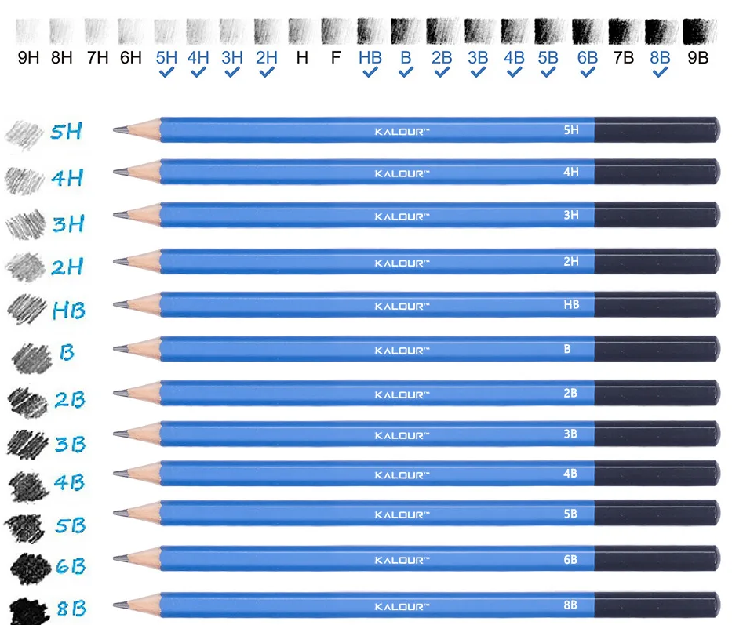
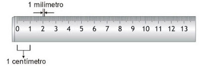
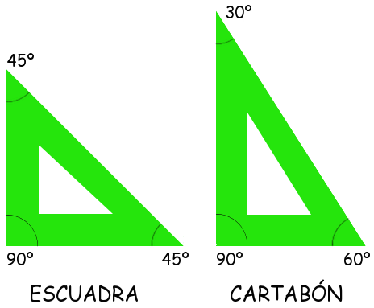

# Instrumentos de dibujo técnico

Cuando queremos que nuestro dibujo sea la **versión final y precisa** de un objeto, lista para ser fabricada, pasamos del croquis a un **plano** o **dibujo delineado**. Este tipo de dibujo ya no se hace a mano alzada, sino que se emplean **herramientas auxiliares** para asegurar su exactitud. Estas son conocidas como **instrumentos de dibujo técnico**.

A continuación, veremos los instrumentos básicos que usaremos en Tecnología, para qué sirven y cómo se utilizan.

## Lápices y portaminas

Para el dibujo técnico, preferimos los **lápices de mina dura** (identificados con la letra **H**, como 2H o 4H), ya que su trazo es más **fino, limpio y preciso**. Los lápices blandos (con la letra **B**) dejan un trazo más grueso y oscuro, y se usan más en dibujo artístico para sombrear.  
También se pueden usar **portaminas**, que mantienen siempre el grosor del trazo y no hace falta sacarles punta.

{align=center width=70%}  

## Regla graduada

{align=right width=40%}

Es una plancha delgada y rígida con una **escala dividida en centímetros y milímetros**. Nos sirve para:  
- **Medir longitudes** con precisión.  
- **Trazar líneas rectas** de forma exacta.  

En dibujo técnico, es muy importante que las líneas sean perfectas, por eso no debemos dibujar a mano alzada cuando hacemos un plano.

## Escuadra y cartabón 

Son dos **plantillas triangulares** de plástico transparente que forman ángulos específicos:  

{align=right width=30%}  

- La **escuadra** tiene un ángulo de **90º** y dos de **45º**.  
- El **cartabón** tiene ángulos de **90º, 60º y 30º**.  

¿Para qué sirven?  
- Usándolas **juntas**, podemos trazar **líneas paralelas y perpendiculares** con facilidad.  
- También nos ayudan a dibujar ángulos rectos (90º) o inclinados (30º, 45º, 60º) sin necesidad de medirlos cada vez.  

Son herramientas **imprescindibles** en dibujo técnico, sobre todo cuando dibujamos piezas mecánicas o planos arquitectónicos.

## Compás  

El compás es un instrumento formado por **dos brazos articulados**:  
- Un brazo lleva una **aguja** que se clava en el papel para marcar el centro.  
- El otro brazo tiene una **mina o punta** que gira alrededor del centro para trazar **circunferencias** y **arcos perfectos**.  

Es muy útil para dibujar ruedas, engranajes, círculos decorativos o cualquier forma curva con precisión.

## Transportador de ángulos 

Es una plantilla semicircular o circular, normalmente transparente, dividida en **grados** (de 0º a 180º o de 0º a 360º).  
Sirve para:  
- **Medir ángulos** que ya están dibujados.  
- **Dibujar ángulos exactos**, como uno de 37º o 115º, que no se pueden hacer solo con escuadra y cartabón.

## Soporte (El papel)  

Normalmente, en dibujo técnico usamos **papel de formato A4** (el tamaño de un folio estándar), que es **blanco, liso y mate**.  
El papel mate no refleja la luz, lo que hace más fácil dibujar y medir sin que molesten brillos.  

En algunos casos se utilizan otros formatos:  
- **A3** (más grande, el doble de un A4): para planos complejos o muy detallados.  
- **Papel milimetrado**: tiene una cuadrícula impresa que facilita las mediciones.

## Consejos para usar bien los instrumentos

✅ Mantén tus instrumentos **limpios** y sin arañazos para que las líneas salgan perfectas.  
✅ Usa la **mina adecuada** (dura para trazos finos, blanda para sombras).  
✅ Al usar la regla, **apoya el lápiz siempre del mismo lado** para evitar líneas torcidas.  
✅ No presiones demasiado el compás, para evitar agujerear el papel.  
✅ Guarda los instrumentos en **un estuche rígido** para que no se rompan ni se deformen.

