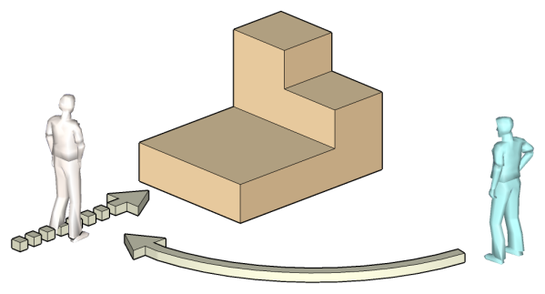
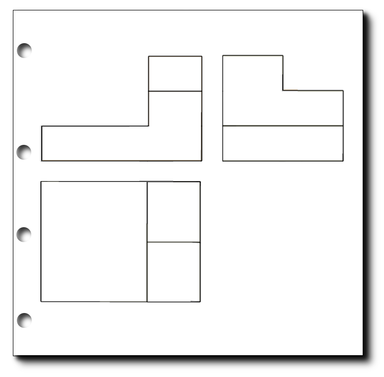

# **5.1. Las tres vistas principales: Alzado, Planta y Perfil**

{align=right width=40%}

Las vistas son las proyecciones de las caras de un objeto sobre diferentes planos (como si fueran paredes imaginarias). Aunque un objeto tiene **seis caras**, para definirlo por completo normalmente nos bastan **tres vistas principales**:

*   **Alzado:** Es la vista más importante, la que nos da más información del objeto. Es la imagen que vemos al mirar el objeto **de frente**.
*   **Planta:** Es la imagen que vemos al mirar el objeto **desde arriba**.
*   **Perfil:** Es la imagen que vemos al mirar el objeto **desde un lado**. 
    *   Puede ser el perfil izquierdo (mirando desde la izquierda) o el derecho (mirando desde la derecha).
  

## **5.1.2. Pasos para la obtención de las tres vistas principales**

{align=right width=30%}

Vamos a imaginar que nos piden que dibujemos las **vistas** que representan la figura de al lado .

**Paso 1: Elegir el Alzado**

El **alzado**, es la proyección realizada sobre el Plano Vertical (PV).

Elegir el Alzado, es una tarea sumamente importante. 

!!!note "Importante"

    Hay que elegir como **alzado la vista que proporcione mayor información** de la pieza. Elegir el alzado, es una tarea sumamente importante. 

Después de elegir el alzado, nos tendremos que «situar» mentalmente, delante de la pieza y obtener las proyecciones sobre el Plano Vertical (PV) de cada uno de los planos que conforman la pieza.

{align=right width=100%}

Según esto, el alzado que dibujaremos en el papel sería:

{style="display: block; margin: 0 auto" width=30%}

**Paso 2. Búsqueda de la Planta**

{align=right width=40%}

Para obtener la Planta, a partir de la situación utilizado para sacar el Alzado,** «subiremos» mentalmente encima de la pieza y proyectaremos (miramos) hacia abajo**, hacia el Plano Horizontal.

La vista obtenida desde esta posición, es la planta de la pieza

{style="display: block; margin: 0 auto" width=30%}

**Paso 3. Representación del Perfil**

{align=right width=40%}

La vista llamada Perfil, es la proyección de la pieza que se realiza sobre el Plano de Perfil (PP).

Pasa obtener** el perfil izquierdo**, tendremos que cambiar nuestra posición, nos tendremos que **dirigir a la izquierda y proyectar** sobre al plano de Perfil. Tendremos el Perfil izquierdo proyectado sobre el plano derecho.

Según esto, el perfil que encontraríamos sería:

{style="display: block; margin: 0 auto" width=30%}

## **5.1.3. La colocación de las vistas**

{align=right width=30%}

Para que todo el mundo pueda interpretar el plano de la misma manera, la **posición de las vistas sigue una regla internacional** (en Europa usamos el Sistema Europeo). La colocación es siempre la misma:

1.  El **Alzado** se dibuja en **primer lugar**.
2.  La **Planta** se dibuja justo **debajo** del alzado.
3.  El **Perfil**:
    * Perfil **Izquierdo** se dibuja justo a la **derecha** del alzado.
    * Perfil **Derecho** se dibuja justo a la **izquierda** del alzado.

Y así es como se presentarían finalmente:

{style="display: block; margin: 0 auto" width=40%}

## **5.1.4. Posiciones relativas de las tres vistas principales**

A partir de lo explicado, decidimos utilizar el Sistema Europeo de proyección para todos los ejemplos de esta web.

Según eso, hemos visto cómo las vistas (alzado, planta y perfil) adoptan unas posiciones dentro de la lámina en las que el perfil, está a la derecha del alzado y la planta, debajo del alzado.

{align=right width=100%}

   
## **5.1.5. Correspondencia entre las tres vistas**

Cuando dibujamos un objeto en un plano, usamos tres vistas: la vista de frente (alzado), la vista desde arriba (planta) y la vista de lado (perfil). Si te para a pensar, hay ciertas medidas que coinciden en distintas vistas:

* La **anchura** (lo ancho que es el objeto) debe ser igual en la vista de frente (alzado) y en la vista desde arriba (planta ).

* La **altura** (lo alto que es el objeto) debe coincidir en la vista de frente (alzado) y de lado (perfil).

* La **profundidad o longitud** (lo que mide de atrás hacia adelante) debe ser la misma en la vista desde arriba (planta) y la vista de lado (perfil).

Para ayudar a que estas dimensiones encajen, a veces se dibuja una línea inclinada a 45 grados llamada línea de inglete. Esta línea ayuda a "traspasar" las medidas desde la vista de arriba a la vista de lado, asegurando que todo cuadre bien.

{align=right width=100%}

*Tabla resumen de correSpondencia de medidas entre vistas*  

|                                | **Alzado** (frontal) | **Planta** (arriba) | **Perfil** (lado) |
|--------------------------------|----------------------|---------------------|-------------------|
| Altura   :arrow_up_down:       | X                    |                     | X                 |
| Anchura :left_right_arrow:     | X                    | X                   |                   |
| Profundidad o longitud :arrow_upper_left: |                      | X                   | X                 |