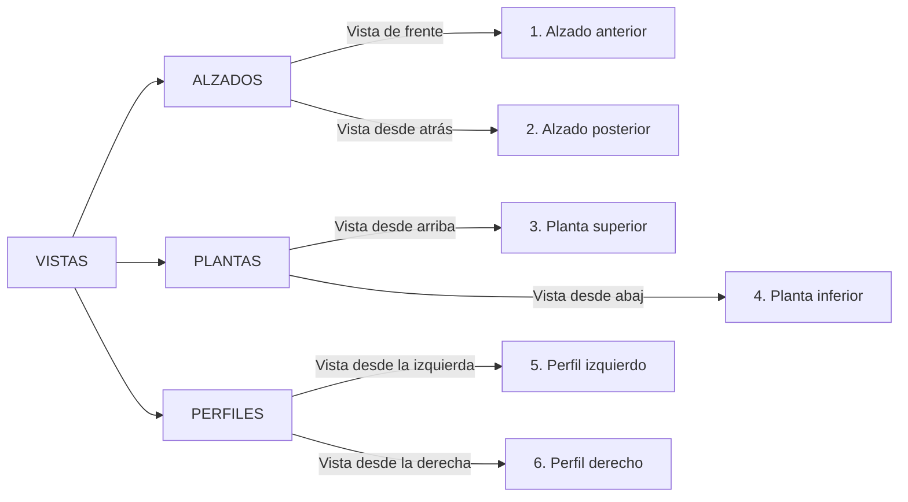
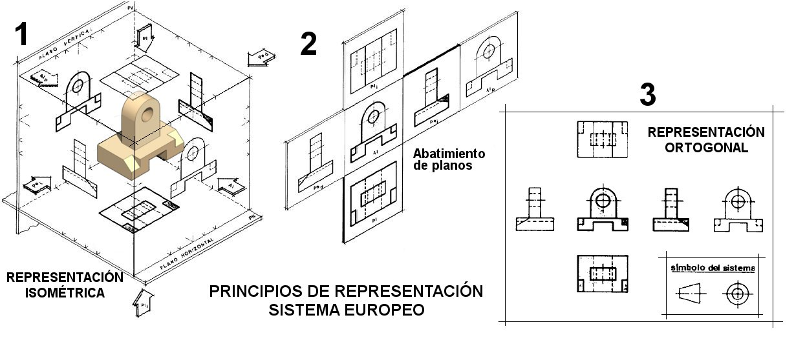

## **Capítulo 5.2. Las seis vistas de un objeto**

Aunque el **alzado, la planta y el perfil (izquierdo)** son las tres vistas más importantes, un objeto tiene en realidad **seis caras**. Por tanto, podemos obtener hasta **seis vistas diferentes**, que se nombran de la siguiente manera:

  
Sin embargo, casi nunca es necesario dibujar las seis vistas. La razón es que, con las tres vistas principales (alzado, planta y perfil izquierdo), la mayoría de los objetos ya quedan perfectamente definidos y se entiende su forma y medidas sin ninguna duda.

{ align=left width=100% }

***

## **4.. La Colocación de las Vistas (Sistema Europeo)**

{align=right width=40%}

Para que todos los dibujos técnicos se puedan interpretar de la misma forma, la posición de las vistas sigue una norma internacional (UNE 1032 en España). Es como si metiéramos el objeto en una caja de cristal y luego desplegáramos sus caras.

Debajo se pueden ver las vistas desde la representación isométrica a la representación ortogonal en el Sistema Europeo.

{ align=left }

La colocación es siempre la siguiente:

1.  **El Alzado (vista de frente) es la vista principal** y se toma como referencia. Se coloca en el centro del área de dibujo.
2.  **La Planta (vista desde arriba)** se dibuja siempre **debajo** del alzado.
3.  **El Perfil Izquierdo (lo que vemos desde la izquierda)** se dibuja a la **derecha** del alzado.

Aplicando esta misma lógica de "desplegar la caja", las otras tres vistas se colocarían así:

*   **La Planta Inferior (vista desde abajo)** se dibujaría **encima** del alzado.
*   **El Perfil Derecho (lo que vemos desde la derecha)** se dibujaría a la **izquierda** del alzado.
*   **La Vista Posterior (lo que vemos desde atrás)** se dibujaría a la derecha del perfil izquierdo.

Normalmente, con las tres vistas principales (alzado, planta y perfil izquierdo) es suficiente para definir un objeto.

***

¿Entendido?. Entonces, para que quede claro, si estás dibujando el alzado de un coche y quieres añadir la vista desde el lado del conductor (el izquierdo), ¿en qué posición la dibujarías con respecto al alzado?

Si el alzado es la vista central, ¿dónde crees que se dibujaría la vista desde abajo (planta inferior) o la vista desde la derecha (perfil derecho)?

***

Ahora que sabemos cómo dibujar la forma de un objeto desde sus tres vistas principales, ¿qué información fundamental crees que nos falta para que alguien pueda fabricarlo con las medidas exactas?