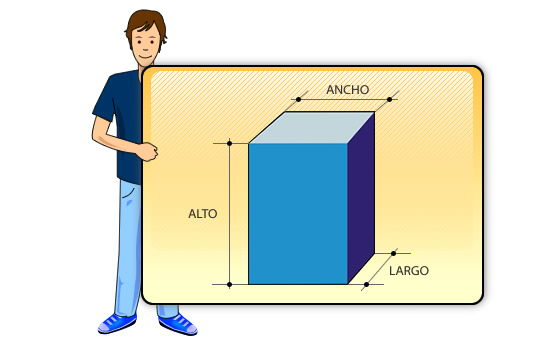
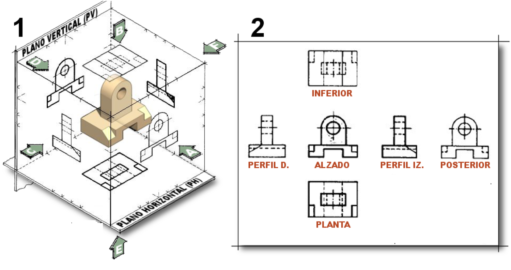

La pregunta que te lancé era cómo representar un objeto de tres dimensiones en una hoja de papel, que solo tiene dos. Es un gran reto, y la solución es uno de los conceptos más importantes del dibujo técnico.

¡Vamos al siguiente capítulo!

***

# **Capítulo 5: Las Vistas de un Objeto (Sistema Diédrico)**

## **5.1. Introducción a la

{align=right width=40%}

Como ya sabemos, los objetos reales tienen **volumen** (alto, ancho y profundo), ¡pero el **papel es plano**!. Para solucionar esto, el dibujo técnico utiliza un método llamado **Sistema Diédrico**, que consiste en representar el objeto como si lo miráramos desde diferentes posiciones. Cada una de estas imágenes se llama **vista**.

{align=right width=100%}