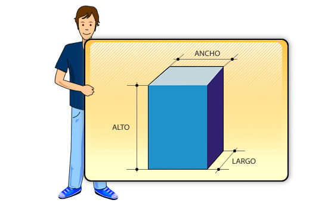
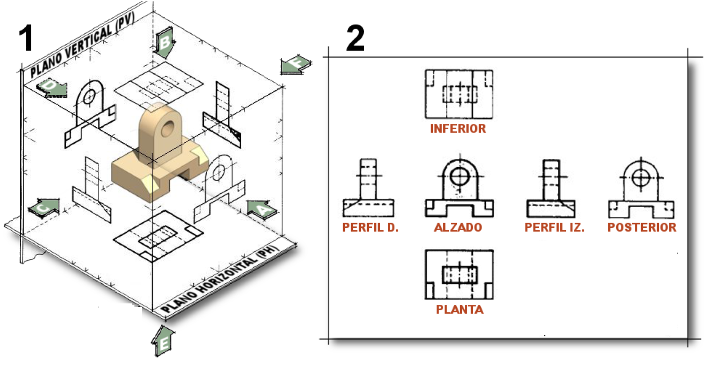

# Las vistas de un objeto (Sistema Diédrico)

Ahora que ya conocemos las herramientas, tenemos un **nuevo reto**: los objetos reales tienen **tres dimensiones** (alto, ancho y profundidad), pero el **papel solo tiene dos** (largo y ancho).
  
¿Cómo se te ocurre que podríamos representar un objeto tridimensional, como una silla o una caja, en una hoja de papel para que se entiendan todas sus caras: lo que se ve de frente, desde arriba y desde un lado?

En este capítulo descubriremos la respuesta: las **vistas** o **proyecciones**, que son la clave del dibujo técnico.

## Introducción a las vistas

{align=right width=40%}

Como ya sabemos, los objetos reales tienen **volumen** (alto, ancho y profundo), ¡pero el **papel es plano**!. Para solucionar esto, el dibujo técnico utiliza un método llamado **Sistema Diédrico**, que consiste en representar el objeto como si lo miráramos desde diferentes posiciones. Cada una de estas imágenes se llama **vista**.

{align=right width=100%}