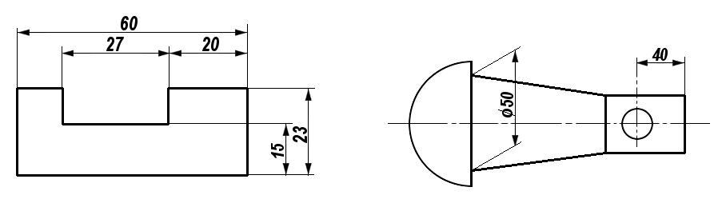
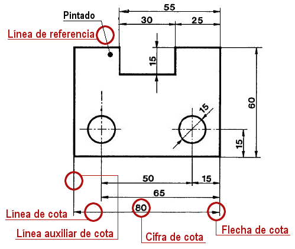
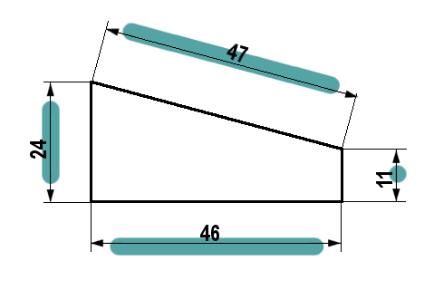
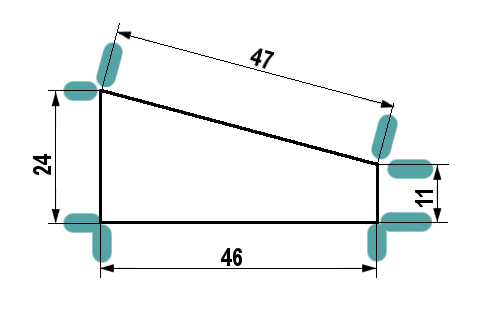

¡Estupendo! Pasemos a la acotación. Es el paso lógico y fundamental para que un plano sea útil de verdad.

Como habíamos comentado, una vez dibujadas las vistas (alzado, planta y perfil), nos falta la información más importante para poder fabricar el objeto: sus medidas exactas. A este proceso de añadir las medidas a un plano se le llama **acotar**.

***

# **Capítulo 6: La Acotación (poniendo las medidas)**

{align=right width=60%}

Ya sabemos representar la forma de un objeto con sus vistas, pero para que alguien pueda construirlo, necesitamos indicar sus dimensiones reales.

!!!note "Acotación"

    La **acotación** es el proceso de añadir las medidas a un dibujo técnico siguiendo un conjunto de reglas o normas para que cualquiera pueda interpretarlas correctamente.

El objetivo es que el plano tenga la información mínima, suficiente y adecuada para su fabricación.

## **5.1. Elementos de una Cota**

Para acotar, utilizamos una serie de elementos que siempre son los mismos:

*   **Línea de cota:** Es una línea fina y continua, paralela a la medida que estamos indicando. Se dibuja a unos 8 mm de la arista del objeto.
*   **Cifra de cota:** Es el número que indica la medida real del objeto en milímetros (mm), aunque no se escriben las unidades. Se coloca encima y en el centro de la línea de cota.
*   **Líneas auxiliares de cota:** Son líneas finas que parten de la pieza y delimitan la línea de cota. Sobresalen un poco (2-3 mm) de la línea de cota.

{align=right width=60%}

*   **Flechas de cota:** Son los extremos de la línea de cota. Todas las flechas de un mismo dibujo deben ser iguales.
*   **Símbolos:** A veces, la cifra de cota va acompañada de un símbolo para dar más información. Los más comunes son:
    *   **R** para indicar el radio de un arco.
    *   **⌀** para indicar el diámetro de una circunferencia.

Vamos a profundizar un poco más en cada elemento.

{align=right width=40%}

### **5.1.1. Línea de cota**

Sirven para "soportar" las cifras que indican las medida. **Encima de ellas colocaremos la cifra que indica la dimensión** de esa medida, por lo que las líneas de cota suelen tener la misma longitud que la arista que se va a acotar.

#### Reglas Esenciales para las Líneas Auxiliares de Cota

1.  **Cómo dibujar las líneas (Apariencia):** Las líneas que indican la medida (**líneas de cota**) deben dibujarse **finas y continuas**. De esta manera, se distinguen claramente de las líneas que forman el objeto.

2.  **Dirección de la medida (Paralelismo):** Las líneas de cota se deben colocar **paralelas** a la arista del objeto que se quiere medir.

3.  **Ubicación y separación:** Las cotas se deben situar, **preferiblemente, en el exterior de la pieza**. La primera línea de cota debe estar separada del objeto una distancia considerable (alrededor de **8 mm**) para que la cifra de cota sea legible.

4.  **Final de la línea (Terminación):** Las líneas de cota terminan en **flechas** (triángulos isósceles). Si el espacio es muy pequeño, las flechas pueden cambiarse por un punto.

5.  **Prohibiciones (Interferencia y Ejes):** Es una norma esencial que las líneas de cota **no deben cruzarse entre sí**. Además, **nunca se deben utilizar los ejes o las aristas** del objeto como si fueran líneas de cota.

{align=right width=40%}

### **5.1.2. Línea auxiliar de cota**

Es la línea que **marca los límites de la línea de cota**, nos indica en donde empieza la medida y en donde acaba Es una línea fina perpendicular a la superficie a medir y, de la misma forma, perpendicular a la línea de cota.

#### Reglas Esenciales para las Líneas Auxiliares de Cota

1.  **Trazado y Apariencia:** Se deben dibujar con las mismas características que las líneas de cota: con **línea llena, continua y fina**.
2.  **Dirección (Perpendicularidad):** Estas líneas son generalmente **perpendiculares** (forman 90 grados) a las líneas de cota. Excepcionalmente, en algunos casos, pueden trazarse a 60º.
3.  **Función de Extensión:** Se utilizan partiendo de las aristas de la pieza o de sus extremos. Son necesarias cuando las líneas de cota no pueden colocarse justo entre los bordes del objeto.
4.  **Longitud de Sobrante:** Para que sean visibles, deben sobrepasar la línea de cota que delimitan. Deben superar la línea de cota unos **2 mm**.
5.  **Uso de Ejes como Referencia:** Las líneas de eje (las que marcan el centro de figuras circulares o simétricas) **pueden aprovecharse** como líneas auxiliares de cota.
6.  **Prohibición de Corte:** Para mantener la claridad del dibujo, las líneas de cota y las líneas auxiliares de cota **no deben cortarse**. (Aunque las líneas auxiliares sí pueden cruzarse entre sí, si es necesario, siempre que se evite dicho cruce cuando sea posible).

{align=right width=35%}

### **5.1.3. Cifra de cota**

Es el **número** que marca la medida. Tiene que ser claro para que no exista la posibilidad de error. Tiene que estar apoyado sobre la línea de cota.

#### Reglas Esenciales para las Cifras de Cota

1.  **El Valor es la Realidad:** La cifra siempre debe indicar la **medida real** de la longitud del objeto, sin importar si el dibujo está ampliado o reducido.
2.  **Tamaño y Uniformidad:** Los números deben tener una altura uniforme y clara. Se recomienda que tengan una altura aproximada de **3 a 4 mm** para que se lean bien (y nunca menos de 2,5 mm).
3.  **Unidad Única:** Todas las medidas de un mismo dibujo deben expresarse en la **misma unidad**, que generalmente son los **milímetros (mm)**. Si tienes que usar otra unidad, se debe indicar justo después de la cifra.
4.  **Posición Fija:** Las cifras se colocan siempre **encima de la línea de cota**. Su base debe ser **paralela** a dicha línea.
5.  **Ubicación Preferida:** Siempre que sea posible, el número debe estar **dentro** de las líneas auxiliares de cota. Si el espacio es muy pequeño, la cifra se coloca por fuera.
6.  **Organización Vertical:** Si tienes varias cotas puestas una sobre la otra, deben colocarse de forma **ordenada y alineada**.
7.  **¡Prohibido Cruzar!** Por claridad, la cifra **no debe ser separada ni cruzada por ninguna línea**. Tampoco se debe colocar sobre los bordes o aristas del dibujo.

{align=right width=35%}

### **5.1.4. Flecha de cota**

Es el elemento donde **finaliza las líneas de cota**. Sirve para indicar de donde a donde llega la dimensión de esa cota, aunque no siempre finaliza en flecha. Como se ve más detalladamente en los ejemplos de abajo, hay otros elementos que sustituyen a las flechas.

La flechas de cota tienen forma de triángulos isósceles de una longitud **L de unos 3 mm** ; el ángulo desigual de dicho triángulo es de **15º**.

#### Reglas Esenciales para dibujar las Flechas de Cota

1.  **Terminación Estándar:** Cada línea de cota debe acabar en **dos flechas** situadas en los extremos. Estas flechas generalmente tienen la forma de un **triángulo isósceles** y se rellenan.
2.  **Ángulo Correcto:** El ángulo que forman los lados de la punta de la flecha debe ser de **15º**.
3.  **Tamaño y Uniformidad:** Todas las flechas que dibujes en el plano deben ser **iguales** (mantener una longitud uniforme).
4.  **Ubicación Principal:** Siempre que sea posible, las flechas se colocan **por dentro** de las líneas auxiliares de cota (las que salen de la pieza). Si no hay suficiente espacio (porque la medida es muy pequeña), se colocan **por fuera** de esas líneas.
5.  **Alternativa por Falta de Espacio:** Si la distancia a acotar es tan pequeña que las flechas quedan "muy juntas" y no caben, se deben sustituir por **puntos**.
6.  **Dibujos Especiales:** En los planos de **construcción y estructuras metálicas**, en lugar de flechas rellenas, a veces se utiliza un trazo inclinado de **45º**.

***
### **5.2. Reglas básicas para acotar**

Para que todo el mundo entienda las medidas, debemos seguir unas normas fundamentales:

1.  **No repetir cotas:** Una medida solo se debe indicar una vez en todo el plano. No se debe acotar la misma distancia en el alzado y en la planta, por ejemplo.
2.  **Colocar las cotas fuera de la figura:** Siempre que sea posible, las cotas se sitúan en el exterior del dibujo.
3.  **Usar la vista más adecuada:** Cada cota se debe colocar en la vista que mejor represente esa parte del objeto.
4.  **No cruzar las líneas de cota:** Las líneas de cota no deben cruzarse entre ellas ni con otras líneas del dibujo.
5.  **No acotar sobre líneas ocultas:** No se deben poner medidas sobre partes del objeto que no se ven directamente.

***

Ahora que conocemos las reglas básicas, imagina que tienes las vistas (alzado, planta y perfil) de un cubo que mide 40 mm de lado.

Si tuvieras que acotar el cubo, ¿qué tres medidas (alto, ancho y profundo) pondrías y en qué vista colocarías cada una para no repetir ninguna?