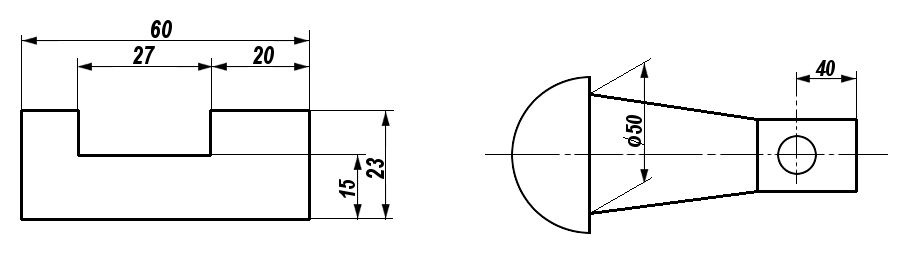
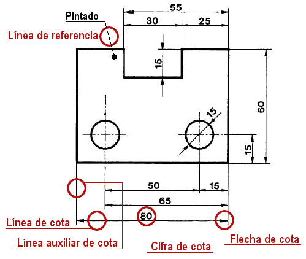
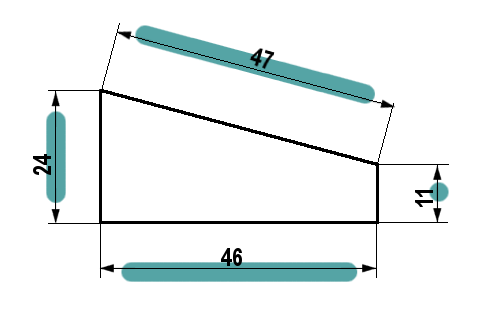
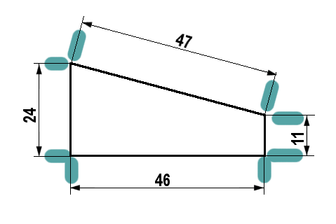
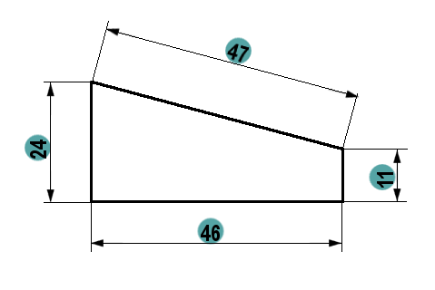

# La acotación (poniendo las medidas)

{align=right width=50%}

Una vez dibujadas las vistas (alzado, planta y perfil), nos falta la información más importante para poder fabricar el objeto: sus **medidas exactas**. A este proceso de añadir las medidas a un plano se le llama **acotar**.

!!!note "Acotación"
    La **acotación** es el proceso de añadir las medidas a un dibujo técnico siguiendo un conjunto de reglas o normas para que cualquiera pueda interpretarlas correctamente.

El objetivo es que el plano tenga la información mínima, suficiente y adecuada para su fabricación.

## Elementos de una cota

{align=right width=40%}

Para acotar, utilizamos una serie de elementos gráficos normalizados que nos permiten indicar las dimensiones de un objeto de forma **clara y precisa**. Los principales elementos son:

1.   **Línea de cota** 
2.    **Cifra de cota** 
3.   **Líneas auxiliares de cota** 
4.   **Flechas de cota**
5.   **Símbolos**

Vamos a profundizar un poco más en cada elemento

### 1. Línea de cota

* Es la línea que **indica la medida** de una arista o parte del objeto.
* Sirven para **soportar las cifras** que indican las medida, por lo que las líneas de cota suelen tener la misma longitud que la arista que se va a acotar.

{align=right width=40%}

#### Reglas Esenciales para las líneas de cota

1.  **Cómo dibujarlas:** Las líneas de cota se dibujan con línea fina y continua. Así se diferencian bien de las líneas gruesas que forman el objeto.

2.  **Dirección:** Las líneas de cota deben ir paralelas (en la misma dirección) al lado del objeto que estás midiendo.

3.  **Dónde colocarlas:** Se ponen fuera del objeto, separadas unos 8 mm del borde, para que el número de la medida se vea bien y no tape nada.

4.  **Cómo terminan:** Las líneas de cota terminan en flechas alargadas en los extremos. Si no hay espacio, se puede poner un punto en lugar de la flecha.

5.  **Qué no hacer:** 
    1.  Las líneas de cota **no pueden cruzarse** entre ellas.

    2.  **Nunca uses los bordes del objeto o las líneas de eje como si fueran líneas de cota.** Esas líneas tienen otra función.

### 2. Línea auxiliar de cota

* Es la línea que **marca los límites de la línea de cota**, nos indica en donde empieza la medida y en donde acaba.
* Es una línea fina perpendicular a la superficie a medir y, de la misma forma, perpendicular a la línea de cota.

{align=right width=40%}

#### Reglas Esenciales para las líneas auxiliares de cota

1.  **Tipo de línea:** Se dibujan con línea fina y continua, igual que las líneas de cota.

2.  **Dirección:** Estas líneas deben ser perpendiculares (en ángulo recto, 90º) a la línea de cota. Es decir, forman una "L" con ella.

3.  **Para qué sirven:** Se usan para alargar los bordes del objeto cuando no hay suficiente espacio para poner la línea de cota directamente sobre la pieza.

4.  **Largo de la línea:** Deben sobresalir un poco de la línea de cota (unos 2 mm), para que se vean claramente.

5.  **Las líneas de eje también sirven:** Si el objeto tiene un eje (línea que marca el centro), puedes usarlo como línea auxiliar sin tener que dibujar otra línea.

6.  **Evitar cruces:** Las líneas auxiliares no deben cruzarse con las líneas de cota. Esto hace que el dibujo sea más claro y fácil de entender.

{align=right width=35%}

### 3. Cifra de cota

* Es el **número** que marca la medida.
* Tiene que ser **claro** para que no exista la posibilidad de error. 
* Tiene que estar **apoyado sobre la línea de cota**.
* Normalmente, las medidas se expresan en **milímetros (mm)**, pero no es necesario escribir "mm" después del número.

#### Reglas Esenciales para las cifras de cota

1.  **Medida real:** El número siempre indica el tamaño real del objeto.

2.  **Tamaño claro:** Los números deben ser legibles, aproximadamente de 3-4 mm de alto.

3.  **Misma unidad:** Todas las medidas en el mismo dibujo en la misma unidad (generalmente milímetros).

4.  **Encima de la línea:** El número va encima de la línea de cota, centrado.

5.  **Evitar cruces:** El número no debe cruzar líneas ni colocarse sobre los bordes del dibujo.

{align=right width=35%}

### 4. Flecha de cota

* Es el elemento que **finaliza las líneas de cota**.
* Sirve para indicar **de donde a donde llega la dimensión** de esa cota.
* Las flechas de cota tienen forma de triángulos isósceles de una longitud **L de unos 3 mm** ; el ángulo desigual de dicho triángulo es de **15º**.

#### Reglas Esenciales para dibujar las flechas de cota

1.  **Terminación estándar:** Cada línea de cota debe acabar en **dos flechas** situadas en los extremos.

2.  **Forma de la flecha:** Las flechas son **triángulos** alargados rellenos pequeños (triángulos isósceles).

3.  **Todas iguales:** Todas las flechas del dibujo deben tener el mismo tamaño.

4.  **Dónde colocarlas:**   Las flechas van dentro de las líneas auxiliares de cota. Si no hay espacio (porque la medida es muy pequeña), se ponen fuera.

    * Si no caben: Cuando el espacio es muy pequeño y las flechas no caben, se sustituyen por puntos.

## Reglas básicas para acotar

Para que todo el mundo entienda las medidas, debemos seguir unas normas fundamentales:

1.  **No repetir cotas:** Una medida solo se debe indicar una vez en todo el plano. No se debe acotar la misma distancia en el alzado y en la planta, por ejemplo.
2.  **Colocar las cotas fuera de la figura:** Siempre que sea posible, las cotas se sitúan en el exterior del dibujo.
3.  **Usar la vista más adecuada:** Cada cota se debe colocar en la vista que mejor represente esa parte del objeto.
4.  **No cruzar las líneas de cota:** Las líneas de cota no deben cruzarse entre ellas ni con otras líneas del dibujo.
5.  **No acotar sobre líneas ocultas:** No se deben poner medidas sobre partes del objeto que no se ven directamente.