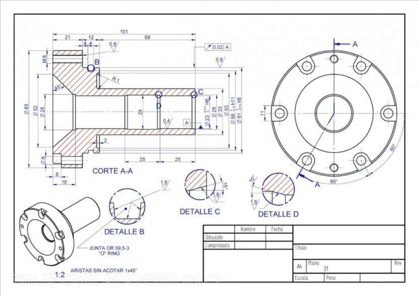

 

***

### **Introducción a la Expresión Gráfica**

¡Te doy la bienvenida al curso de **Expresión Gráfica**!

{align=right width=50%}

Aquí descubrirás un nuevo idioma que no usa palabras, sino imágenes: un **lenguaje visual que todo el mundo puede entender**. A lo largo de la historia, el ser humano ha usado dibujos para comunicarse, desde las pinturas en las cuevas hasta los planos de los edificios más modernos. Aprenderás la diferencia entre el **dibujo artístico**, que sirve para expresar sentimientos, y el **dibujo técnico**, que nos permite representar objetos de forma precisa para poder fabricarlos. En esta materia, nos convertiremos en auténticos expertos del dibujo técnico, una herramienta fundamental en el mundo de la tecnología.

A lo largo de este curso, exploraremos las técnicas y secretos que te permitirán comunicar tus ideas de forma clara y universal. Entre los temas principales que estudiaremos se incluyen:

*   🔹 **Del boceto al plano:** Aprenderás a plasmar tus primeras ideas en un **boceto** hecho a mano alzada, para luego detallarlo en un **croquis** con toda la información necesaria y, finalmente, crear un **plano** delineado con herramientas de precisión.
*   🔹 **Los útiles de dibujo:** Conocerás y manejarás las herramientas básicas de todo dibujante, como el lápiz, las reglas, la escuadra, el cartabón y el compás.
*   🔹 **Las vistas de un objeto:** Descubrirás el sistema diédrico para representar un objeto desde diferentes puntos de vista: el **alzado** (de frente), la **planta** (desde arriba) y el **perfil** (de lado).
*   🔹 **La perspectiva:** Aprenderás a dibujar objetos para que parezcan tridimensionales utilizando la **perspectiva isométrica y la caballera**, dos técnicas clave del sistema axonométrico.
*   🔹 **Las escalas:** Entenderás cómo funcionan las **escalas** para poder dibujar objetos muy grandes (como un edificio) en una hoja pequeña, o para ampliar objetos muy pequeños y ver todos sus detalles.
*   🔹 **La acotación:** Aprenderás a **acotar**, que es el arte de añadir las medidas reales a tus dibujos para que cualquiera pueda entender y fabricar tus diseños a la perfección.
*   🔹 **El dibujo por ordenador (CAD):** Daremos el salto al mundo digital utilizando programas de Diseño Asistido por Ordenador (CAD), como **LibreCAD**, para crear planos y diseños de forma fácil y precisa.

Dominar la expresión gráfica es una habilidad indispensable en el proceso tecnológico y te abrirá las puertas a profesiones tan fascinantes como la **arquitectura, la ingeniería, el diseño industrial, la animación, el diseño de videojuegos o la impresión 3D** para crear desde maquetas hasta prótesis.

¡Así que afila tus lápices, enciende el ordenador y prepárate para dar vida a tus ideas! ✏️📐
